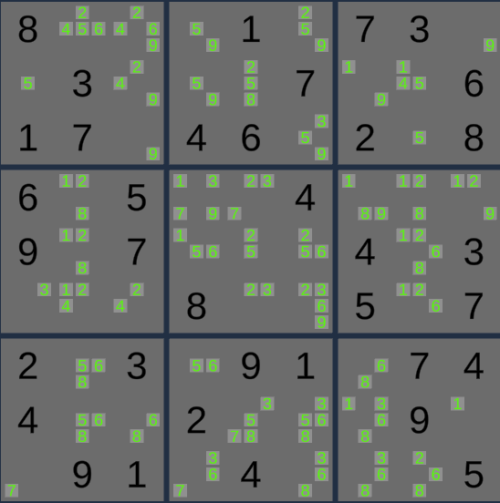
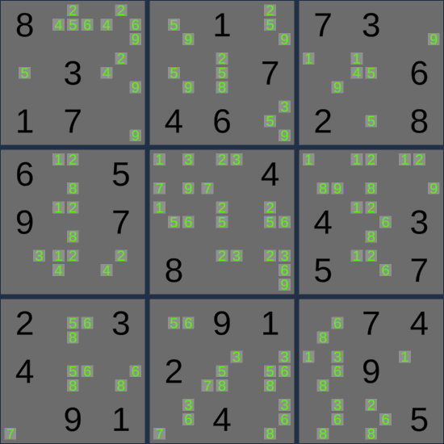

# SudokuWFC
This Unity project generates sudoku board solutions using a Wave Function Collapse algorithm. The Unity project includes support for custom sudoku boards using scriptable objects, which can be edited using a custom editor window.

# Details
The Wave Function Collapse (WFC) algorithm is a constraint-based algorithm developed by Maxim Gumin. The WFC algorithm in the Unity project primarily includes several steps, which are executed until the sudoku board is complete:

1. If board is valid
    1. Select a sudoku cube with the lowest entropy (least amount of available states).
    2. Selecting a random, available number for the sudoku cube.
    3. Propgate the number selection information to affected cubes in the sudoku board.
2. Else (board is invalid)
    1. Revert last sudoku cube update to the sudoku board.
    2. Propgate the revert information to affected cubes in the sudoku board.

# References

[Maxim Gumin's Wave Function Collapse Github Repository](https://github.com/mxgmn/WaveFunctionCollapse)

[BorisTheBrave's Article on the Wave Function Collapse Algorithm](https://www.boristhebrave.com/2020/04/13/wave-function-collapse-explained/)

[Martin Donald's Video Explanation of the Wave Function Collapse Algorithm](https://youtu.be/2SuvO4Gi7uY)

# Demonstration

Initial easy sudoku board from websudoku.com:

Solving the sudoku board using the WFC algorithm:

